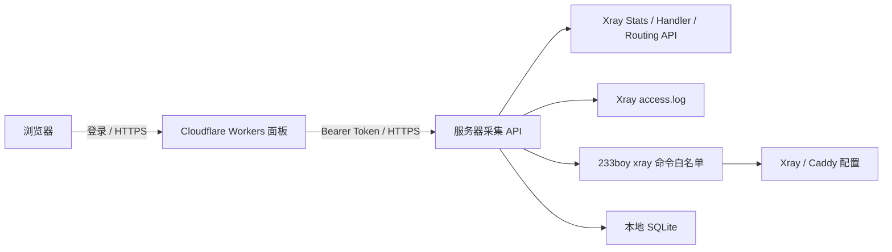

# X-Ray Link Monitoring Panel

一个面向个人 Xray 服务器的明亮型监控与管理面板。它把 Xray 统计接口、访问日志和客户端配置整理成可登录的 Web 后台，用于查看每条链接的流量、来源 IP、多个客户端 UUID、到期时间和用量限制。

## 功能

- 查看服务器、Xray 服务和采集时间状态
- 按链接统计上行、下行和累计流量
- 查看每条链接的历史来源 IP、连接次数和最后连接时间
- 查看代理连接访问的目标域名或 IP，支持按时间、链接、UUID、来源 IP 和关键词筛选
- 查看目标域名连接次数排行，并默认保留 30 天访问历史
- 展示同一入站 `clients` 中的全部 UUID
- 为 IP、设备备注和 UUID 设置备注
- 单独禁用/恢复 IP 或 UUID
- 为链接设置月度流量额度，达到上限后自动停用
- 为链接设置到期时间，到期后自动停用
- 查看服务器网卡账单周期流量（默认额度 500 GiB，可配置重置锚点和周期天数）
- 可视化管理服务器现有的 233boy Xray 脚本：启动、停止、重启、配置检测、修复、更新和日志
- 创建、编辑、复制和删除 Xray 链接，支持 VLESS、VMess、Trojan、Shadowsocks 和 Socks 的 12 种常用组合
- 所有面板命令使用服务端白名单和参数校验，不向浏览器开放任意 Shell
- 配置变更前自动备份，并记录命令成功/失败、目标和时间
- 管理后台登录保护，所有写操作均在服务端鉴权

## 需要了解的限制

- 面板展示的 UUID 是 **Xray 客户端凭据**，不是手机或电脑的硬件序列号。
- 多个设备使用不同 UUID 时，可以分别展示和禁用；多个实体设备共用同一个 UUID 时，Xray 无法区分它们。
- Xray 协议不会传递浏览器 User-Agent，因此通常无法可靠获取手机型号、系统型号或硬件编号。
- 访问网站记录来自 Xray 连接日志：HTTPS 只能看到目标域名或 IP 和端口，看不到具体页面路径、搜索词、账号、密码或网页正文。
- 使用 ECH、二级代理或直接连接 IP 时，日志可能只能显示目标 IP，无法还原域名。
- UUID 被禁用后不能建立新连接；已经存在的长连接可能需要短暂时间才会结束。
- 服务器周期流量来自指定网卡的本机计数，不等同于云厂商计费后台，重装系统或重置网卡可能影响统计。
- TLS 类链接需要一个已经解析到服务器的域名；创建时 233boy 脚本会继续负责 Caddy 和证书配置。
- 为防止误操作和任意命令执行，面板不开放卸载、重装、`bin`、`api`、`xapi`、`debug` 等原始高风险入口。

### 支持创建的协议

| 协议 | 面板标识 | 创建时需要 |
| --- | --- | --- |
| VLESS Reality | `vless-reality` | 端口、SNI；UUID 可自动生成 |
| VMess TCP / mKCP | `vmess-tcp` / `vmess-mkcp` | 端口、伪装类型；UUID 可自动生成 |
| VMess WS / gRPC TLS | `vmess-ws-tls` / `vmess-grpc-tls` | 已解析域名、路径 |
| VLESS WS / gRPC / XHTTP TLS | `vless-ws-tls` / `vless-grpc-tls` / `vless-xhttp-tls` | 已解析域名、路径 |
| Trojan WS / gRPC TLS | `trojan-ws-tls` / `trojan-grpc-tls` | 已解析域名、路径 |
| Shadowsocks | `shadowsocks` | 端口、加密方式；密码可自动生成 |
| Socks | `socks` | 端口、用户名和密码 |

## 架构



面板只通过带 Bearer Token 的 HTTPS API访问采集器；SSH 密码、服务器 root 凭据和 Xray 私钥不会进入浏览器。

## 一键部署

部署分成两部分：在 Xray 服务器安装采集器，然后把管理面板发布到 Cloudflare Workers。两个脚本都可以重复运行，用于首次安装或后续升级。

### 前置条件

服务器：

- Linux + systemd
- 已安装并正常运行的 Xray
- 如需使用可视化命令和全协议 CRUD，需安装 233boy Xray 管理脚本并能执行 `xray help`
- 已安装 Caddy，主配置会导入 `/etc/caddy/sites/*.conf`
- Python 3、curl、OpenSSL
- 一个已解析到服务器的 HTTPS API 域名，例如 `monitor.example.com`

本地电脑：

- Git
- Node.js 22 或更高版本
- Cloudflare 账号

### 1. 安装服务器采集器

```bash
git clone https://github.com/wangkay007/X-Ray-Link-Monitoring-Panel.git
cd X-Ray-Link-Monitoring-Panel

sudo MONITOR_API_DOMAIN=monitor.example.com \
     XRAY_PUBLIC_HOST=proxy.example.com \
     bash scripts/install-collector.sh
```

- `MONITOR_API_DOMAIN`：面板访问采集器使用的 HTTPS 域名。
- `XRAY_PUBLIC_HOST`：面板创建 VLESS Reality 链接时写入分享链接的服务器域名或 IP。

安装脚本会：

1. 备份 `/etc/xray/config.json`
2. 补齐 Xray Handler、Stats 和 Routing API
3. 在重启前执行 Xray 配置校验，失败时自动恢复
4. 安装采集器、systemd 服务和日志轮转
5. 生成随机 Bearer Token
6. 下载 Cloudflare IP 网段
7. 添加 Caddy HTTPS API 站点
8. 启动服务并完成健康检查

成功后终端会输出：

```text
MONITOR_ENDPOINT=https://monitor.example.com/v1/snapshot
MONITOR_TOKEN=一段随机令牌
```

请立即保存这两个值。令牌同时保存在服务器 `/etc/xray-monitor.env`，权限为 `0600`。

如果你的路径不同，可以覆盖以下变量：

```bash
sudo XRAY_CONFIG=/path/to/config.json \
     XRAY_CONF_DIR=/path/to/conf \
     XRAY_BIN=/path/to/xray \
     XRAY_MONITOR_INTERFACE=ens3 \
     MONITOR_API_DOMAIN=monitor.example.com \
     XRAY_PUBLIC_HOST=proxy.example.com \
     bash scripts/install-collector.sh
```

### 2. 一键发布管理面板

```bash
bash scripts/deploy-dashboard.sh
```

脚本会依次询问：

- 上一步生成的 `MONITOR_ENDPOINT`
- `MONITOR_TOKEN`
- 后台登录密码

默认用户名为 `admin`。脚本会在需要时打开 Cloudflare 登录页面，完成构建后将凭据作为 Cloudflare Worker Secrets 上传，不会写入仓库。

也可以用环境变量执行非交互部署：

```bash
MONITOR_ENDPOINT=https://monitor.example.com/v1/snapshot \
MONITOR_TOKEN='your-monitor-token' \
ADMIN_USERNAME=admin \
ADMIN_PASSWORD='your-long-dashboard-password' \
bash scripts/deploy-dashboard.sh
```

部署完成后会得到一个 `*.workers.dev` 地址。需要自定义域名时，在 Cloudflare 控制台为 Worker 添加 Custom Domain。

Cloudflare 发布流程使用 [vinext 的 Workers 构建](https://github.com/cloudflare/vinext) 和 [Wrangler Secrets](https://developers.cloudflare.com/workers/configuration/secrets/)。

## 本地开发

```bash
npm ci
cp .env.example .env.local
```

修改 `.env.local`：

```dotenv
MONITOR_ENDPOINT=https://monitor.example.com/v1/snapshot
MONITOR_TOKEN=your-monitor-token
ADMIN_USERNAME=admin
ADMIN_PASSWORD=your-local-password
SESSION_SECRET=your-random-session-secret
```

启动：

```bash
npm run dev
```

质量检查：

```bash
npm run lint
npm test
```

`.env*`、Cloudflare 本地状态、数据库、构建产物和 OpenAI Sites 项目标识均被 Git 忽略。

## 常用运维命令

```bash
# 服务状态
systemctl status xray xray-monitor caddy

# 采集器日志
journalctl -u xray-monitor -f

# 重启采集器
systemctl restart xray-monitor

# 面板使用的 Xray 管理脚本
xray help

# 本机健康检查
source /etc/xray-monitor.env
curl -H "Authorization: Bearer ${XRAY_MONITOR_TOKEN}" \
  http://127.0.0.1:8787/v1/snapshot
```

升级：

```bash
git pull
sudo MONITOR_API_DOMAIN=monitor.example.com \
     XRAY_PUBLIC_HOST=proxy.example.com \
     bash scripts/install-collector.sh

bash scripts/deploy-dashboard.sh
```

## 配置

### 采集器环境变量

| 变量 | 默认值 | 说明 |
| --- | --- | --- |
| `XRAY_MONITOR_TOKEN` | 自动生成 | 采集 API Bearer Token |
| `XRAY_MONITOR_LISTEN` | `127.0.0.1` | 采集 API 监听地址 |
| `XRAY_MONITOR_PORT` | `8787` | 采集 API 端口 |
| `XRAY_MONITOR_DB` | `/var/lib/xray-monitor/monitor.db` | SQLite 数据库 |
| `XRAY_ACCESS_LOG` | `/var/log/xray/access.log` | Xray 访问日志 |
| `XRAY_API_SERVER` | `127.0.0.1:47495` | Xray API |
| `XRAY_CONFIG_DIR` | `/etc/xray/conf` | Xray 入站配置目录 |
| `XRAY_MONITOR_HOST` | 必填 | 新分享链接使用的公网地址 |
| `XRAY_MONITOR_INTERFACE` | 自动检测 | 服务器流量统计网卡 |
| `XRAY_MONITOR_MONTHLY_BYTES` | `536870912000` | 服务器月流量额度（500 GiB） |
| `XRAY_MONITOR_PERIOD_DAYS` | `30` | 服务器流量账单周期天数 |
| `XRAY_MONITOR_RESET_ANCHOR` | `1970-01-01` | 账单周期重置锚点（`YYYY-MM-DD`）；例如某次重置为 2026-08-15，就填写该日期 |
| `XRAY_MONITOR_STATIC_META` | `/etc/xray-monitor-static-meta.json` | 旧链接的自定义名称和入口映射 |
| `XRAY_WEBSITE_RETENTION_DAYS` | `30` | 访问网站汇总记录保留天数 |

旧配置需要自定义显示名称时，可参考
[`collector/static-meta.example.json`](collector/static-meta.example.json)。

### 面板 Secrets

| 变量 | 说明 |
| --- | --- |
| `MONITOR_ENDPOINT` | 采集器完整 HTTPS snapshot 地址 |
| `MONITOR_TOKEN` | 与服务器一致的 Bearer Token |
| `ADMIN_USERNAME` | 后台用户名 |
| `ADMIN_PASSWORD` | 后台密码，建议至少 12 位 |
| `SESSION_SECRET` | 登录 Cookie HMAC 密钥 |

## 项目结构

```text
app/                         Web 面板和服务端 API 路由
collector/xray_monitor.py    Xray 采集与控制服务
scripts/install-collector.sh 服务器一键安装/升级
scripts/patch-xray-config.py 安全补齐 Xray API 配置
scripts/deploy-dashboard.sh  Cloudflare Workers 一键发布
tests/                       登录和多 UUID 回归测试
worker/                      Cloudflare Worker 入口
```

## 安全建议

- 不要把 `.env.local`、`/etc/xray-monitor.env` 或任何真实令牌提交到 Git。
- 采集器保持监听 `127.0.0.1`，只通过 Caddy HTTPS 暴露。
- 为后台设置独立密码，不要复用服务器 root 密码。
- 公开仓库前执行 `git grep` 或专用 secret scanner。
- 定期更新 Xray、Caddy、Node.js 和依赖。
